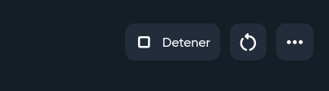

[Readme на русском](README_RU.md)

# What is this project?
Kubek is a Minecraft web server control panel that supports Linux and Windows. The project offers an intuitive interface for managing servers, plugins and mods and more. Includes an integrated FTP server and file manager with syntax highlighting. Users can control access to servers through a user and role system

[](https://github.com/Seeroy/kubek-minecraft-dashboard/actions/workflows/build.yml)

**Features:**
- **Linux and Windows supported**
- **Intuitive Single-Page UI:** A clean and straightforward user interface for easy navigation and usage
- **Plugins and Mods Management:** Manage plugins and mods for your Minecraft server
- **Server Properties Editor:** Easily edit server.properties file to customize server settings
- **FTP Server:** Integrated FTP server for convenient file transfer
- **File Manager:** File manager with syntax highlighting for managing server files
- **Users and Roles System:** Manage users and roles with access restrictions to servers

**Natively supported cores:**
- Official Vanilla Server
- PaperMC
- Spigot
- Waterfall
- Velocity
- Purpur
- Magma

# Installation

## Download prepared release (recommended)

Download and run the file suitable for your OS [from latest release](https://github.com/Seeroy/kubek-minecraft-dashboard/releases/latest)

## Build from sources

Clone repository and install libs
**Node.js >= 20 required!**
```
git clone https://github.com/Seeroy/kubek-minecraft-dashboard.git
cd kubek-minecraft-dashboard
npm install
```

Start after installation
```
npm start
```

## Use Docker container

If you know all the ports you need to use, you can run Kubek in Docker using a command like this. In this example, port 3000 is used for the panel itself, and 25565 for the server
Replace YOUR_DIRECTORY with your folder path

```
docker run -d --name kubek \
            --restart unless-stopped \
			-p 3000:3000 \
			-p 25565:25565 \
			-v /YOUR_DIRECTORY/servers:/usr/kubek/servers \
			-v /YOUR_DIRECTORY/logs:/usr/kubek/logs \
			-v /YOUR_DIRECTORY/binaries:/usr/kubek/binaries \
			-v /YOUR_DIRECTORY/config.json:/usr/kubek/config.json \
			seeroy/kubek-minecraft-dashboard
```

If you want to open all ports, then use the command below (with it, Kubek will always work on port 3000, port remapping is not available)
```
docker run -d --name kubek --network host \
            --restart unless-stopped \
			-v /YOUR_DIRECTORY/servers:/usr/kubek/servers \
			-v /YOUR_DIRECTORY/logs:/usr/kubek/logs \
			-v /YOUR_DIRECTORY/binaries:/usr/kubek/binaries \
			-v /YOUR_DIRECTORY/config.json:/usr/kubek/config.json \
			seeroy/kubek-minecraft-dashboard
```

## add new webcomponent extend html

methods:
- getStyles()
- getinputvalues()
- setInputValues()
- resetInputValues()
- connectedCallback()
input atribute:
- type: number, text || string, checkbox || switch || boolean
- id: unique id
- name: unique name
- value: default value
- placeholder: placeholder
- disabled: disabled
- readonly: readonly
custom elements:
- textarea and split lines with \n (for multiline) return array


## Use termux (Android)

1. Install termux
	- https://f-droid.org/en/packages/com.termux/
	- https://github.com/termux/termux-app
2. Install Packages
	- pkg install nodejs
	- pkg install git
	- pkg install nodejs-npm
4. clone repository
	- git clone https://github.com/nglmercer/kubek-minecraft-dashboard
	- cd kubek-minecraft-dashboard
	- npm install
	- npm run start
### Optional
5. install code-server
	- pkg install code-server
	- code-server --auth none --port 8080 &

### install termux shell
```
pkg update
pkg upgrade
pkg install git
pkg install nodejs
pkg install code-server
git clone https://github.com/nglmercer/kubek-minecraft-dashboard
cd kubek-minecraft-dashboard
npm install
npm run start
```

## spanish description
	# projecto opensource para crear y hostear servidores de miencraft funciona en windows, linux, android (usando termux) 
	este proyecto se encarga de facilitar la creación de servidores de miencraft en cualquier sistema operativo usando js, tambien puedes usar docker , y también permite la gestión de los servidores en la interfaz web.
	este es un fork creado para corregir errores y actualizar las apis que no funcionaban, 
	- tambien puede hostearlo en github codespaces y project idx
	- en proceso de migracion del frontend a webcomponents y tecnologias modernas
	- en proceso de implementacion de mas herramientas para la gestion como un gestor de plugins y mods
	- puede aportar al proyecto en o darme su feedback, estare completamente abierto a cualquier tipo de contribucion
	https://github.com/nglmercer/kubek-minecraft-dashboard


## next updates

### action buttons:
- start server
- stop server
- restart server
- more options : force stop
### mediaquery for mobile
- only show icons
- delegatesFocus: true 
- user inherit font (font-family: inherit)=> material-symbols
### hide icons when status changes
    static setServerStatus = (status) => {
        const statusElement = document.querySelector('status-element');
        if (typeof TRANSLATE[status] !== "undefined") {
            currentServerStatus = status;
            console.log("status", status, TRANSLATE[status]);
            $(".content-header .hide-on-change").hide();
            $(".content-header #server-more-btn").hide();
            if (status === STARTING || status === STOPPING) {
                statusElement.updateStatus(status, TRANSLATE[status]);
                $(".content-header #server-more-btn").show();
            } else if (status === RUNNING) {
                statusElement.updateStatus(status, TRANSLATE[status]);
                $(".content-header #server-restart-btn").show();
                $(".content-header #server-stop-btn").show();
                $(".content-header #server-more-btn").show();
            } else if (status === STOPPED) {
                $(".content-header #server-start-btn").show();

                statusElement.updateStatus(status, TRANSLATE[status]);
            }
        } else {
            return false;
        }
        return true;
    }

